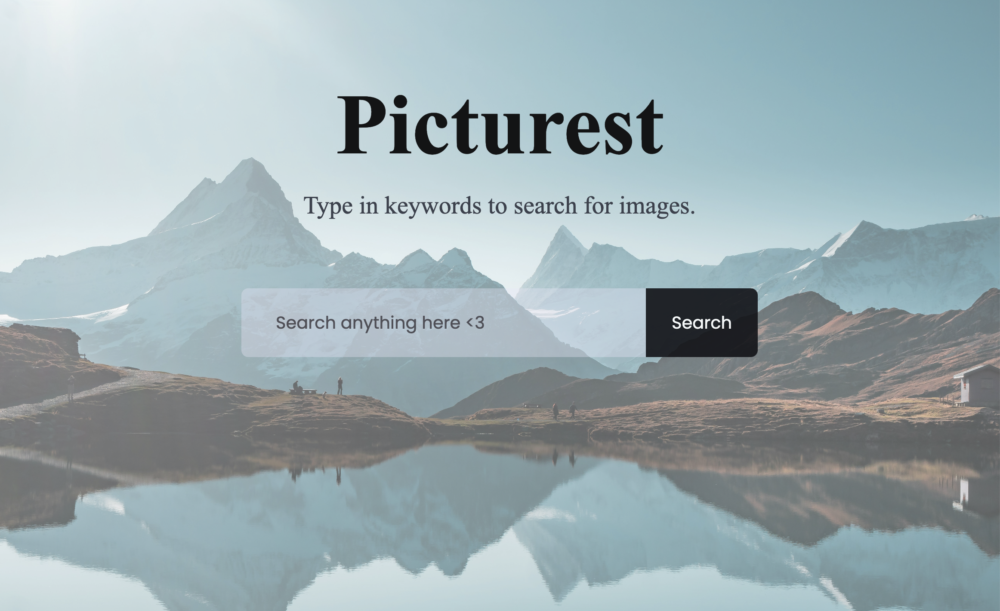

# 🌟 Picturest - An image search website

An interactive web application that allows users to search for images using the **Unsplash API**. The website fetches and displays images dynamically and even updates the background based on the search results.  



## 🚀 Features  
- 🔍 **Search Images**: Enter a keyword and get images from Unsplash.  
- 📄 **Pagination Support**: Load more images using the **"Show More"** button.  
- 🎨 **Dynamic Background**: The background updates based on search results.  
- 🖼 **Clickable Images**: Each image links to its source on **Unsplash**.  
- 🏞 **Default Background**: A fallback background image on page refresh.  

## 🛠 Technologies Used  
- **HTML** - Structuring the webpage.  
- **CSS** - Styling and responsiveness.  
- **JavaScript** - Fetching and displaying images dynamically.  
- **Unsplash API** - Retrieving high-quality images.  

## 📦 Installation & Setup  
1. **Clone this repository**:  
   ```bash
   git clone https://github.com/your-username/image-search-app.git

2. **Navigate to the project folder**:
    ```bash
    cd image-search-app
    ```

3. **Open `index.html` in your browser**.


## 🔑 API Key Setup

This project requires an **Unsplash API key**. To get started:

1. Sign up at [Unsplash Developers](https://unsplash.com/developers).
2. Create a new application to get your **Access Key**.
3. Replace the placeholder in `script.js` with your Access Key:
    ```js
    const accessKey = "YOUR_ACCESS_KEY_HERE";
    ```

## 🚀 How to Use

1. Open `index.html` in your browser.
2. Enter a search term (e.g., "bird", "trees") in the search box.
3. Hit "Enter" or click the "Search" button to display results.
4. Click the "Show More" button to load more images.


## 📜 License

This project is open-source and available under the **MIT License**. See the [LICENSE](LICENSE) file for more details.
